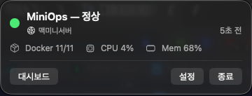
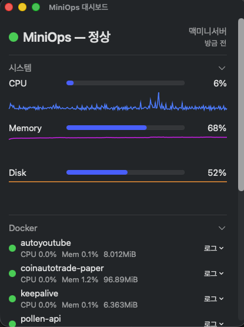

# MiniOps

AI 기반 Mac Mini 서버 모니터링 및 복구 도구

MiniOps는 Mac Mini 홈서버 운영자를 위한 AI 기반 운영 도우미입니다. CPU, 메모리, Docker 상태를 모니터링하고 Health Check를 수행합니다. 같은 Wi‑Fi(LAN)에서 HTTP API로 상태를 조회할 수 있습니다.

## 스크린샷




## v1.0.1 기능 (현재)

- **miniopsd** — GUI 없는 서버 에이전트 (Homebrew 설치 가능)
- **메뉴바 앱** — 같은 Wi‑Fi의 다른 Mac에서 서버 상태 조회 (클라이언트 전용)
- **온보딩 마법사** — LAN 찾기 → Token 붙여넣기 → Docker 설정
- **메뉴바 UX** — 요약 한 줄 (Docker/CPU/Mem), 마지막 갱신 시간
- **대시보드 창** — 메트릭 스파크라인, Docker 컨테이너별 CPU/Memory, Health Check 현황
- **Docker 로그 뷰어** — 검색, 자동 새로고침, 맨 아래 고정, 복사/저장
- **Docker 로그 에러/경고 감지** — ERROR/WARN/FATAL 패턴 자동 감지 및 알림
- **Docker 제어** — 원격 restart/stop (완료 토스트 알림 포함)
- **컨테이너별 CPU/Memory** — `docker stats` 기반 실시간 통계
- **Health Check** — 원격 등록/수정/삭제 (서버에서 실행)
- **macOS 알림** — CPU/Memory/Disk 임계치, 컨테이너 중지, Health Check 실패, 로그 에러
- **메트릭 히스토리** — 최근 1시간 (5초 간격)

## 두 가지 구성

| | Mac Mini (서버) | 같은 Wi‑Fi의 다른 Mac |
|--|-----------------|----------------------|
| 설치 | `brew install miniops` → `miniopsd` | MiniOps 메뉴바 앱 |
| GUI | 없음 (헤드리스) | 메뉴바 UI |
| 역할 | 수집 + API 제공 | 원격 조회 |

## Mac Mini 서버 설치 (Homebrew)

```bash
brew tap wwwshe/miniops https://github.com/wwwshe/MiniOps.git
brew trust wwwshe/miniops
brew install miniops
brew services start miniops

miniopsd --print-config
```

## 다른 Mac (클라이언트) — 메뉴바 앱

1. 앱 실행 → 온보딩 마법사 또는 **설정 (⌘,)**
2. `miniopsd --print-config` 출력 붙여넣기 또는 LAN에서 서버 찾기
3. **연결 테스트** → Docker **연결 테스트** (선택)

## API 엔드포인트

| Path | 설명 |
|------|------|
| `GET /api/v1/health` | API 헬스 (인증 불필요) |
| `GET /api/v1/status` | 전체 상태 요약 |
| `GET /api/v1/metrics` | CPU/Memory/Disk |
| `GET /api/v1/metrics/history` | 메트릭 히스토리 (최근 1h) |
| `GET /api/v1/docker` | Docker 컨테이너 |
| `GET /api/v1/docker/{name}/logs` | Docker 로그 |
| `POST /api/v1/docker/{name}/restart` | Docker 재시작 |
| `POST /api/v1/docker/{name}/stop` | Docker 중지 |
| `GET /api/v1/health-checks` | Health Check 결과 |
| `GET/POST/DELETE /api/v1/health-check-targets` | Health Check 설정 |
| `GET/PATCH /api/v1/settings` | Docker 경로 등 |

## 프로젝트 구조

```
MiniOps/
├── Packages/MiniOpsKit/   # SPM — Core, Monitoring, API
├── Sources/miniopsd/      # 헤드리스 데몬
├── MiniOps/               # Xcode — 메뉴바 앱
└── Formula/               # Homebrew
```

## 로드맵

| 버전 | 기능 |
|------|------|
| v0.1 | 메뉴바 + Health Check + LAN API |
| v0.1.5 | 온보딩, 알림, Docker 제어, 메트릭 히스토리, UX 개선 |
| v0.2 | 로그 수집·보관, Health Check 편집 |
| v0.3 | Docker 로그 에러/경고 패턴 감지 및 알림 |
| v0.4 | 컨테이너별 CPU/Memory (`docker stats`) |
| v0.5 | 대시보드 화면 추가 |
| v1.0 | brew 및 mac release 배포 |
| **v1.0.1** | **mac 앱 로그인 시 자동 실행 추가** |
| v1.1 | Slack / Discord 알림 |
| v1.2 | iOS/iPad 조회 앱 (선택) |

## 라이선스

[MIT](LICENSE)
